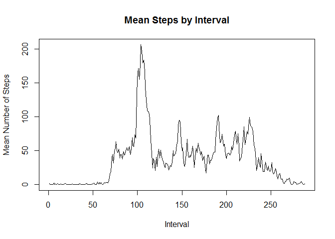

# PA1_template
Elizabeth Eason  
February 8, 2017  


##Reading in the data

```r
setwd("/Users/Lizzie Eason/Desktop/Coursera/5_ReproducibleResearch")
unzip("repdata_data_activity.zip")
fit<-read.csv("activity.csv")
head(fit)
```

```
##   steps       date interval
## 1    NA 2012-10-01        0
## 2    NA 2012-10-01        5
## 3    NA 2012-10-01       10
## 4    NA 2012-10-01       15
## 5    NA 2012-10-01       20
## 6    NA 2012-10-01       25
```

##Calculating the total number of steps per day

```r
totstep<-aggregate(steps ~ date, data = fit, sum, na.rm = TRUE)
head(totstep)
```

```
##         date steps
## 1 2012-10-02   126
## 2 2012-10-03 11352
## 3 2012-10-04 12116
## 4 2012-10-05 13294
## 5 2012-10-06 15420
## 6 2012-10-07 11015
```

##Creating a historgram of the total number of steps taken per day

```r
hist(totstep[,2], main="Histogram of total number of steps per day", xlab="Steps")
```

<!-- -->

##Calculating the mean and median

```r
mean(totstep[,2])
```

```
## [1] 10766.19
```

```r
median(totstep[,2])
```

```
## [1] 10765
```

##Graphing mean number of steps per interval

```r
meanstep<-aggregate(fit[,1],list(fit$interval),function(x){
  mean(x,na.rm=TRUE)
})
plot(meanstep[,2],type="l",main="Mean Steps by Interval", ylab="Mean Number of Steps",xlab="Interval")
```

<!-- -->

##Interval with Maximum Mean Number of Steps

```r
meanstep[max(meanstep[,2]),]
```

```
##     Group.1        x
## 206    1705 56.30189
```

##Number of rows with NA entries

```r
sum(!complete.cases(fit))
```

```
## [1] 2304
```

##Imputing the Data

First, we write a function to replace the NA values in step. The function replaces NA step values with the mean of the steps for that day with all NA's removed, or, if all of the entries for a single day are NA (as is the case with 2012-10-01), then it replaces the NA's with the overall mean of the data with NA's removed.


```r
replacemeant<-function(x){
  for (i in 1:length(x)){
    if (is.na(x[i])){
      if (is.na(mean(x[fit$date==fit$date[i]],na.rm=TRUE)))
      {x[i]<-mean(x,na.rm=TRUE)}
      else
      {x[i]<-mean(x[fit$date==fit$date[i]],na.rm=TRUE)}}
    else x[i]<-x[i]
  }
  x}
```

Next, we apply this function to the steps column and make a new variable, and remove the old variable from the data.

```r
fit$newsteps<-replacemeant(fit$steps)
library(dplyr)
```

```
## Warning: package 'dplyr' was built under R version 3.3.2
```

```
## 
## Attaching package: 'dplyr'
```

```
## The following objects are masked from 'package:stats':
## 
##     filter, lag
```

```
## The following objects are masked from 'package:base':
## 
##     intersect, setdiff, setequal, union
```

```r
fit2<-select(fit,-steps)
head(fit2)
```

```
##         date interval newsteps
## 1 2012-10-01        0  37.3826
## 2 2012-10-01        5  37.3826
## 3 2012-10-01       10  37.3826
## 4 2012-10-01       15  37.3826
## 5 2012-10-01       20  37.3826
## 6 2012-10-01       25  37.3826
```

##Total steps taken per day with new data

```r
totstep2<-aggregate(fit2[,3],list(fit2$date),function(x){
  sum(x,na.rm=TRUE)
})
head(totstep2)
```

```
##      Group.1        x
## 1 2012-10-01 10766.19
## 2 2012-10-02   126.00
## 3 2012-10-03 11352.00
## 4 2012-10-04 12116.00
## 5 2012-10-05 13294.00
## 6 2012-10-06 15420.00
```

##Histogram

```r
hist(totstep2[,2],main="Total Steps Taken per Day",xlab="Steps")
```

<!-- -->

##Calculating the mean and median with new data

```r
mean(totstep2[,2])
```

```
## [1] 10766.19
```

```r
median(totstep2[,2])
```

```
## [1] 10766.19
```

Notice that in relation to the original mean and median, the mean remained the same, and the median is now equal to the mean. Further, from the histogram we can see that this data has much smaller variance. Thus, the effect of imputing data with means makes the data have a much smaller variance.

##Making a weekend indicator:

```r
fit2$fitweekday<-sapply(as.Date(fit2$date),weekdays)
fit2$weekendind<-ifelse(fit2$fitweekday=="Saturday"|fit2$fitweekday=="Sunday","weekend","weekday")
head(fit2)
```

```
##         date interval newsteps fitweekday weekendind
## 1 2012-10-01        0  37.3826     Monday    weekday
## 2 2012-10-01        5  37.3826     Monday    weekday
## 3 2012-10-01       10  37.3826     Monday    weekday
## 4 2012-10-01       15  37.3826     Monday    weekday
## 5 2012-10-01       20  37.3826     Monday    weekday
## 6 2012-10-01       25  37.3826     Monday    weekday
```

#Plotting the mean total number of steps in each interval by the weekend indicator

```r
meanstep2<-aggregate(fit2[,3],list(fit2$interval,fit2$weekendind),function(x){
  mean(x,na.rm=TRUE)
})
head(meanstep2)
```

```
##   Group.1 Group.2        x
## 1       0 weekday 7.006569
## 2       5 weekday 5.384347
## 3      10 weekday 5.139902
## 4      15 weekday 5.162124
## 5      20 weekday 5.073235
## 6      25 weekday 6.295458
```

```r
library(lattice)
xyplot(meanstep2[,3]~meanstep2[,1]|meanstep2[,2], data=fit2, type="l",layout=c(1,2),xlab="Interval",ylab="Steps")
```

<!-- -->
